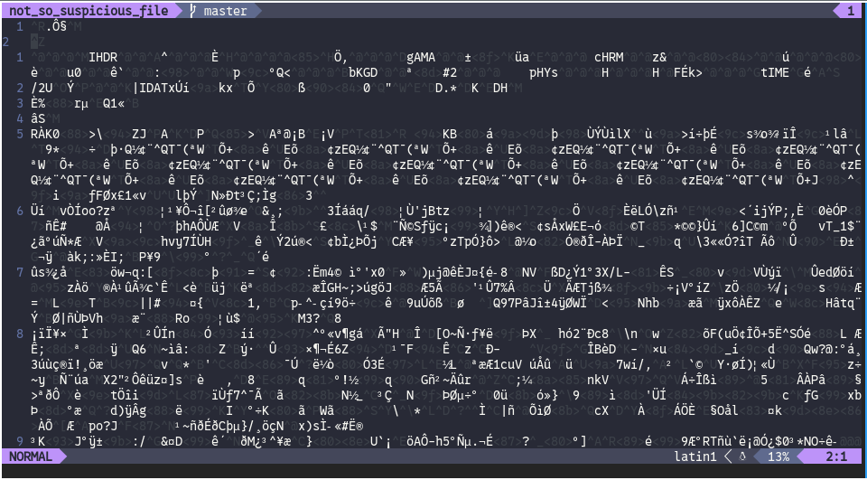
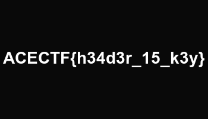

# Broken Secrets

You’ve found a suspicious file, but it seems broken and cannot be opened normally. Your goal is to uncover its secrets.

Submit your answer in the following format: ACECTF{3x4mpl3_fl4g}

Attachments: file named brokenfr

## Solution

The obvious first step, ran file on it and got the following output:

```
brokenfr: 7-zip archive data, version 0.4
```

So, it's a 7z archive. Renamed it to brokenfr.7z and extracted it, out came the following file tree:

```
.
├── Brokenfr.7z
└── _
    ├── [Content_Types].xml
    ├── _rels
    ├── docProps
    │   ├── app.xml
    │   └── core.xml
    └── word
        ├── _rels
        │   └── document.xml.rels
        ├── document.xml
        ├── fontTable.xml
        ├── media
        │   └── not_so_suspicious_file
        ├── settings.xml
        ├── styles.xml
        ├── theme
        │   └── theme1.xml
        └── webSettings.xml

8 directories, 13 files

```

Ran straight to the `not_so_suspicious_file`, and ran file on it:

```
not_so_suspicious_file: data
```

So it needed a little more digging, opened it in `nvim`, just for checking it.



Saw the IHDR and IDAT, figured it was some form of corrupted PNG

ran `:%!xxd` to convert it to hex, and saw the following:

on the top of the file, it seems to be missing the PNG magic bytes


```
00000000: 122e d4a7 0d0a 1a0a 0000 000d 4948 4452  ............IHDR
00000010: 0000 015e 0000 00c8 0800 0000 0085 08d6  ...^............
00000020: 2c00 0000 0467 414d 4100 00b1 8f0b fc61  ,....gAMA......a
00000030: 0500 0000 2063 4852 4d00 007a 2600 0080  .... cHRM..z&...
```

Copied the section from a working png to here, as follows:

```
00000000: 8950 4e47 0d0a 1a0a 0000 000d 4948 4452  .PNG........IHDR
00000010: 0000 015e 0000 00c8 0800 0000 0085 08d6  ...^............
00000020: 2c00 0000 0467 414d 4100 00b1 8f0b fc61  ,....gAMA......a
00000030: 0500 0000 2063 4852 4d00 007a 2600 0080  .... cHRM..z&...
```

renamed the file to `not_so_suspicious_file.png` and opened it:



ACECTF{h34dr_15_k3y}
