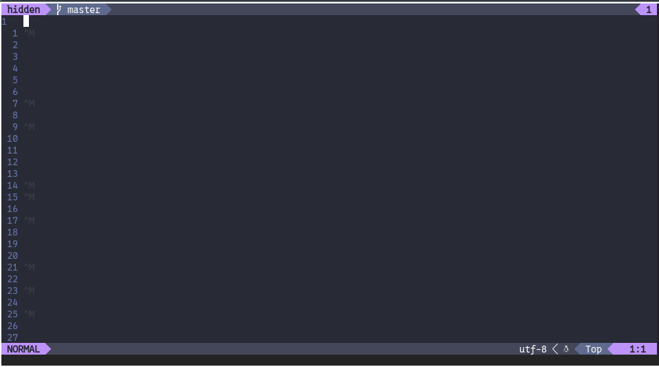

#  Another Reading between the Lines? 

Question: Is this another one of those hidden in plain sight typical normie challenges?
Answer: No.

This challenge is very simple, here you have a file named hidden and all you need to do is get the flag. My focus for this year's CTF is not just the beginning but also ending on a high note, I won't rely on overused "read between the line" challenges and would rather have you guys do some research.

Good Luck!

Attachment: [hidden](./hidden)

## Solution

Ran file on the attachment

```
hidden: ASCII text, with CRLF, LF line terminators
```

Seems to be an ASCII file with mixed line terminators.

Luckily, `neovim` immediately gave away what this was



Those `^M` are what we were looking for, DOS Line endings in a Unix file.

```
00000000: 0a0d 0a0a 0a0a 0a0a 0d0a 0a0d 0a0a 0a0a  ................
00000010: 0a0d 0a0d 0a0a 0d0a 0a0a 0a0d 0a0a 0d0a  ................
00000020: 0a0d 0a0a 0a0a 0a0d 0a0d 0a0a 0d0a 0a0d  ................
00000030: 0a0a 0d0a 0a0a 0a0d 0a0a 0a0a 0d0a 0d0a  ................
00000040: 0a0a 0d0a 0d0a 0d0a 0d0a 0a0d 0a0d 0a0a  ................
00000050: 0d0a 0d0a 0a0d 0a0d 0a0d 0a0a 0a0a 0d0a  ................
00000060: 0d0a 0a0a 0a0a 0a0d 0a0a 0d0a 0d0a 0d0a  ................
00000070: 0d0a 0d0a 0a0d 0a0d 0a0d 0a0a 0a0d 0a0a  ................
00000080: 0a0a 0d0a 0d0a 0a0a 0d0a 0d0a 0a0a 0d0a  ................
00000090: 0d0a 0a0d 0a0a 0a0a 0d0a 0d0a 0a0a 0d0a  ................
```

A simple script to treat `0a` as `0` and `0a0d` as `1`

```python
#!/usr/bin/env python3

file = open("hidden", "rb")

output = open("line.bin", "wb")

content = file.read()

content = content.replace(b"\r\n", (1).to_bytes(1, byteorder="big"))
content = content.replace(b"\n", (0).to_bytes(1, byteorder="big"))
chunk_size = 8
content = [content[i:i+chunk_size] for i in range(0, len(content), chunk_size)]

for byte_str in content:
    current_byte = 0

    for byte_char in byte_str:
        current_byte = current_byte << 1
        current_byte = current_byte | byte_char

    output.write(current_byte.to_bytes(1, byteorder="big"))
```

this gave the output:

```
ACECTF{n0_r34d1n6_be7w33n_7h3_l1n35}
```
