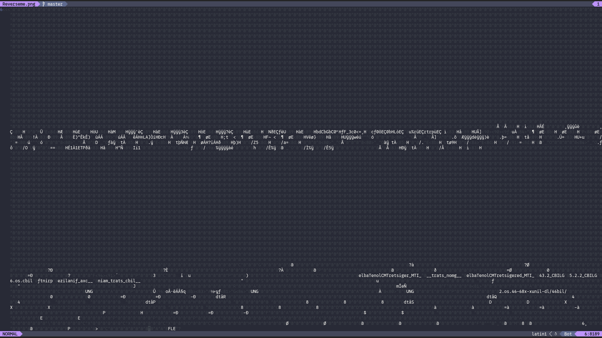
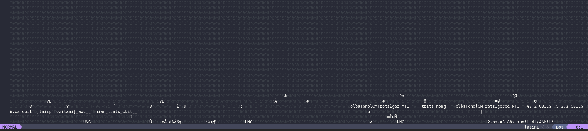
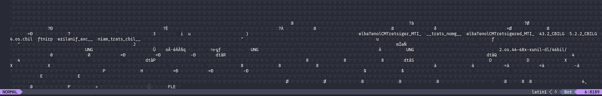

# Significance of Reversing

Over the years, we hackers have been reversing stuff, thinking we understand how everything works and feel good about it. But, sometimes it feels like do we really understand what reversing means in mordern days? Anyways, here's a PNG, let's see if you can reverse your way out of this one.

Attachment: [Reverseme.png](./Reverseme.png)

## Solution

Downloaded the image and tried to open it, but imv came up with nothing, So as standard procedure, i opened it in `neovim` and found the following:





Reversed strings which looked like dynamically linked library paths, and the `FLE` at the end which was `ELF` reversed gave it away

This was a reversed ELF executable

A simple script for reversing it and we were golden

```py
file = open("Reverseme.png", "rb")

data = file.read()

data = data[::-1]

data = data[1:]

file.close()

bin = open("Forward.elf", "wb")

bin.write(data)

bin.close()
```

Running the Forward.elf gave us:

```
Decrypted string: ACECTF{w3_74lk_4b0u7_r3v3r53}
```
